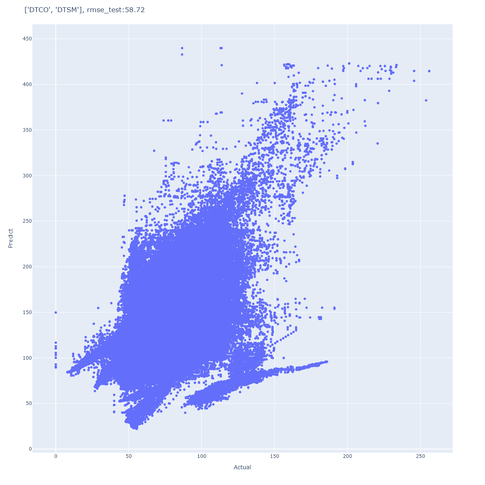

# Model building and tuning
> Here I will explain how models are built and tuned for best performance!

## Table of contents
* [General info](#general-info)
* [Crossplot DTCO-DTSM](#dtco-dtsm)

## Crossplot DTCO-DTSM
