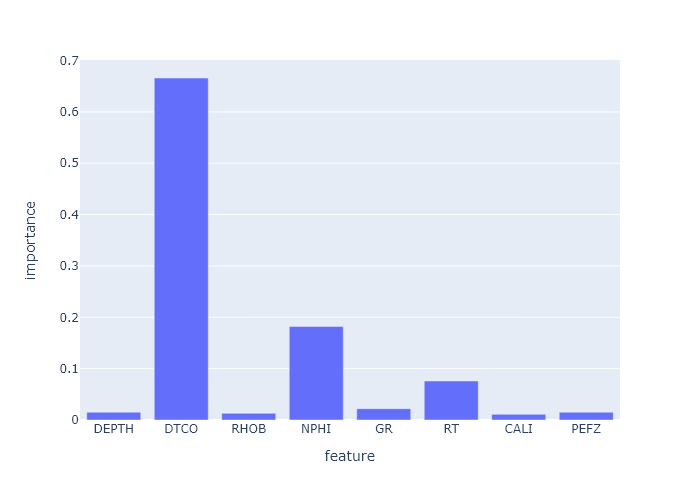

# Model building and tuning
> Here I will explain how models are built and tuned for best performance!

## Table of contents
* [General info](#general-info)
* [Baseline model](#baseline-model)
* [Technologies](#technologies)
* [Setup](#setup)
* [Features](#features)
* [Status](#status)
* [Inspiration](#inspiration)
* [Contact](#contact)

## General info
First, one null model (all predictions are the mean of DTSM) is built. Then a simple linear regression model is built as the baseline model.

Then a gradient boosting model based on xgboost.XGBRegressor(XGB) is built and tested based on 7 features.

Then a neural network model(MLP) from sklearn is built and tested based on 7 features.

Then XGB and MLP models are tuned using RandomizedSearchCV from sklearn and using two different Bayesian hyperparameters tuning library.

Then XGB and MLP models are built and tested based on different combination of features. This is to address the situation when las input does not include all 7 features.

## Baseline model

## Feature importance

* Tech 1 - version 1.0
* Tech 2 - version 2.0
* Tech 3 - version 3.0

## Setup
Describe how to install / setup your local environement / add link to demo version.

## Code Examples
Show examples of usage:
`put-your-code-here`

## Features
List of features ready and TODOs for future development
* Awesome feature 1
* Awesome feature 2
* Awesome feature 3

To-do list:
* Wow improvement to be done 1
* Wow improvement to be done 2

## Status
Project is: _in progress_, _finished_, _no longer continue_ and why?

## Inspiration
Add here credits. Project inspired by..., based on...

## Contact
Created by [@flynerdpl](https://www.flynerd.pl/) - feel free to contact me!
